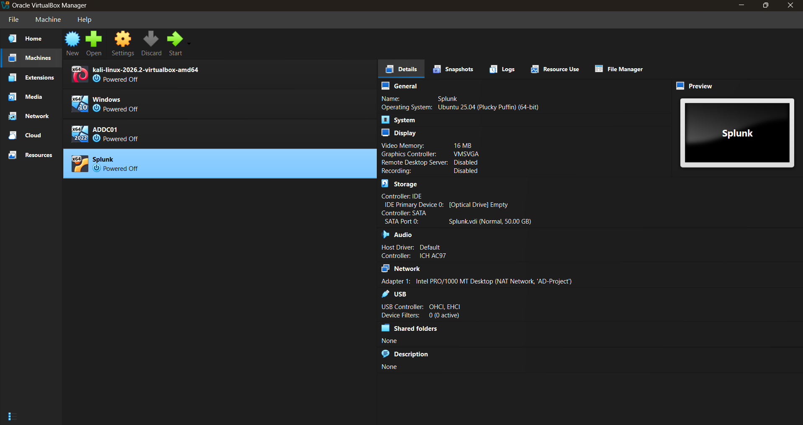
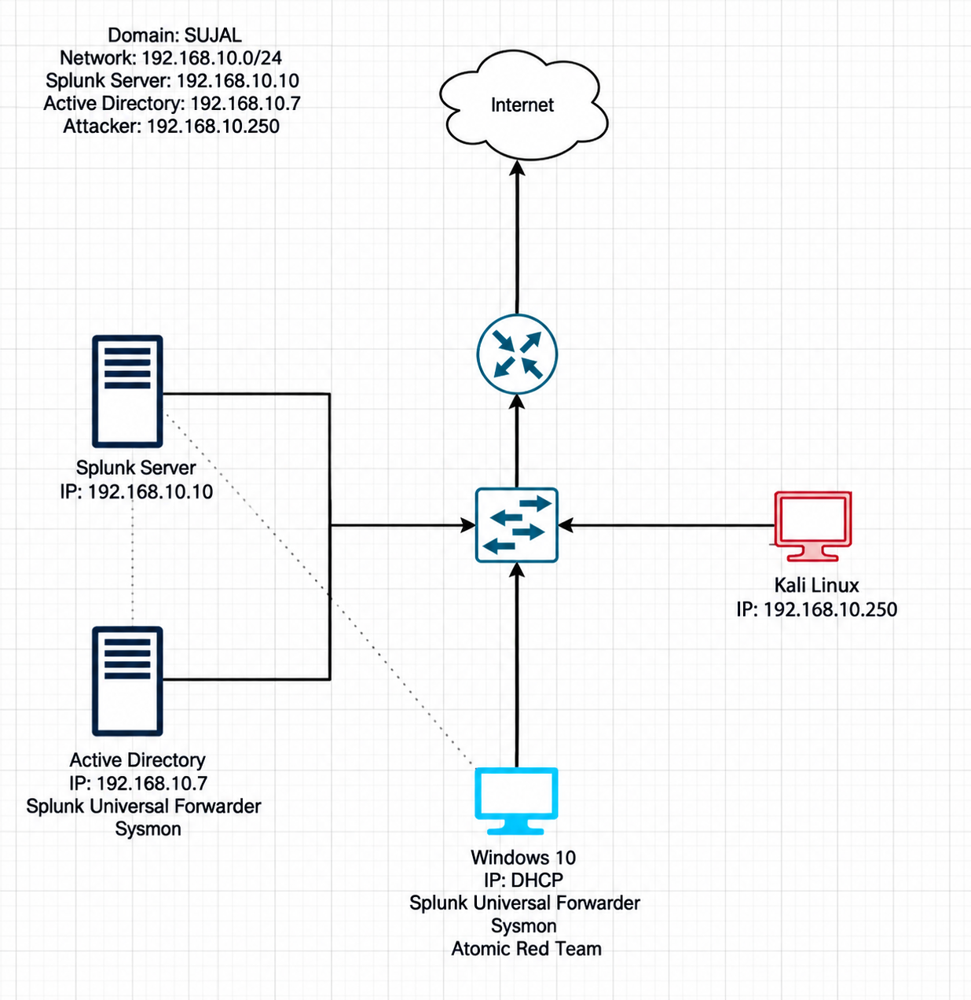

# Active Directory Security Lab with Splunk SIEM — Attack & Detection

A home-lab Security Operations Center (SOC) simulating a small Windows Active
Directory environment, centralizing its logs in Splunk, launching a real RDP
brute-force attack against it, and then detecting that attack through
telemetry — the full "attacker vs. defender" loop.

> **Disclaimer:** Built and run entirely inside an isolated VirtualBox NAT
> network for educational purposes. No systems outside the lab were touched.

---

## Table of Contents
- [Overview](#overview)
- [Skills Demonstrated](#skills-demonstrated)
- [Lab Architecture](#lab-architecture)
- [Walkthrough](#walkthrough)
- [MITRE ATT&CK Mapping](#mitre-attck-mapping)
- [Key Takeaways](#key-takeaways)

---

## Overview

Four virtual machines run on a single isolated network: a Windows Server
acting as an Active Directory Domain Controller, a Windows 10 endpoint joined
to the domain, an Ubuntu server running Splunk as the SIEM, and a Kali Linux
box acting as the attacker.

Sysmon and the Splunk Universal Forwarder are installed on the Windows
machines so their security, system, and Sysmon logs stream into Splunk. From
Kali, an RDP brute-force attack is launched against the endpoint, and Splunk
is used to hunt for and confirm the malicious activity. Finally, Atomic Red
Team emulates adversary techniques mapped to MITRE ATT&CK, and the resulting
detections are validated in Splunk.

## Skills Demonstrated

- SIEM deployment and administration (Splunk Enterprise)
- Endpoint log collection with Sysmon + Splunk Universal Forwarder
- Windows Event Log analysis (Event IDs 4624 / 4625)
- Active Directory administration (DC promotion, OUs, users, domain join)
- Linux server configuration (static IP via netplan, service management)
- Offensive security basics (RDP brute-forcing with Hydra)
- Adversary emulation and detection engineering with Atomic Red Team
- Mapping activity to the MITRE ATT&CK framework

## Lab Architecture

All machines sit on a VirtualBox NAT network (`AD-Project`, `192.168.10.0/24`).

| Machine        | Role                           | IP Address       |
|----------------|---------------------------------|------------------|
| Splunk Server  | SIEM (Ubuntu + Splunk)          | 192.168.10.10    |
| ADDC01         | Domain Controller (Win Server)  | 192.168.10.7     |
| Target         | Endpoint (Windows 10, `sujal.local`) | 192.168.10.100 |
| Kali           | Attacker                        | 192.168.10.250   |
| Gateway        | NAT gateway                     | 192.168.10.1     |

## Walkthrough

The full step-by-step build, with every screenshot placed at the exact step
it documents, lives in `/docs`:

1. [Phase 1 — Building the Lab](docs/phase1-lab-setup.md)
2. [Phase 2 — Splunk & Sysmon (Log Collection)](docs/phase2-splunk-sysmon.md)
3. [Phase 3 — Active Directory & Domain](docs/phase3-active-directory.md)
4. [Phase 4 — Attack & Detection](docs/phase4-attack-and-detection.md)

## MITRE ATT&CK Mapping

| Technique ID | Name                     | How it was exercised                     |
|--------------|--------------------------|-------------------------------------------|
| T1110        | Brute Force              | Hydra RDP password guessing against `tsmith` |
| T1136.001    | Create Account: Local    | Atomic Red Team local account creation (`NewLocalUser`) |
| T1059.001    | Command & Scripting: PowerShell | Atomic Red Team PowerShell execution, detected on `ADDC01` |

## Key Takeaways

- Built end-to-end visibility into a Windows domain: from raw endpoint events
  to searchable, indexed telemetry in a SIEM.
- Saw firsthand what a brute-force attack looks like in the logs — 44 failed
  logons (Event ID 4625) followed by a successful one (4624), with the
  source IP tracing directly back to the attacker.
- Used adversary emulation to safely generate detections and tie real
  activity back to the MITRE ATT&CK framework — the core loop of detection
  engineering.

---

*Built by [Your Name] — [LinkedIn] · [GitHub]*
