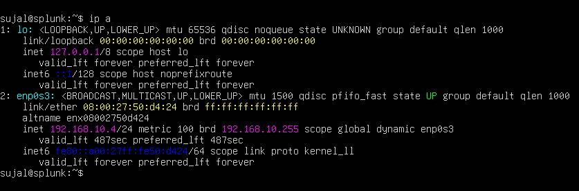
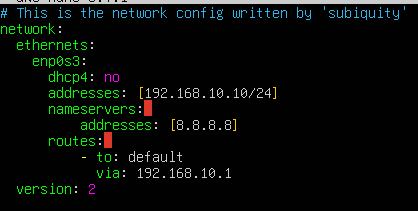
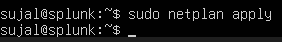
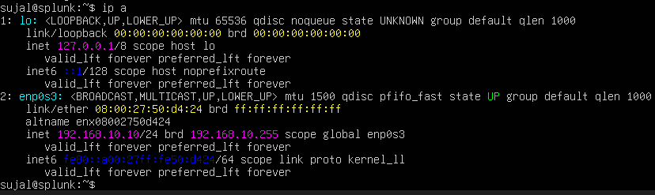
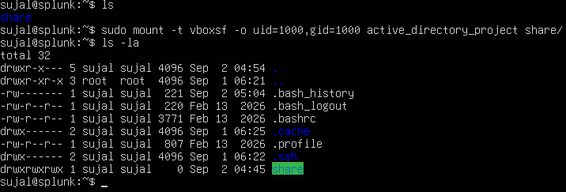
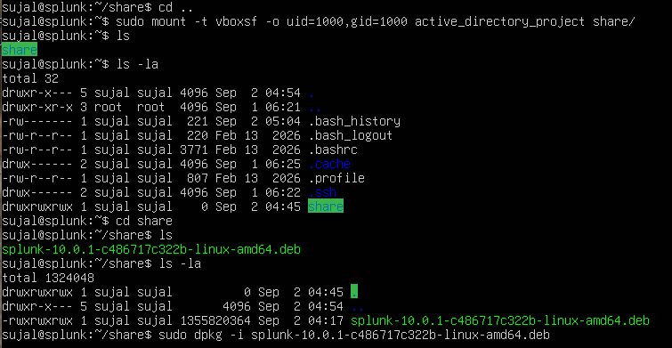
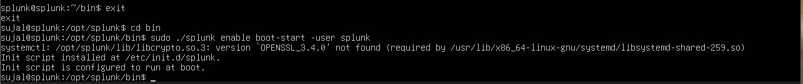
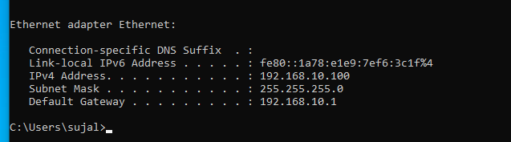
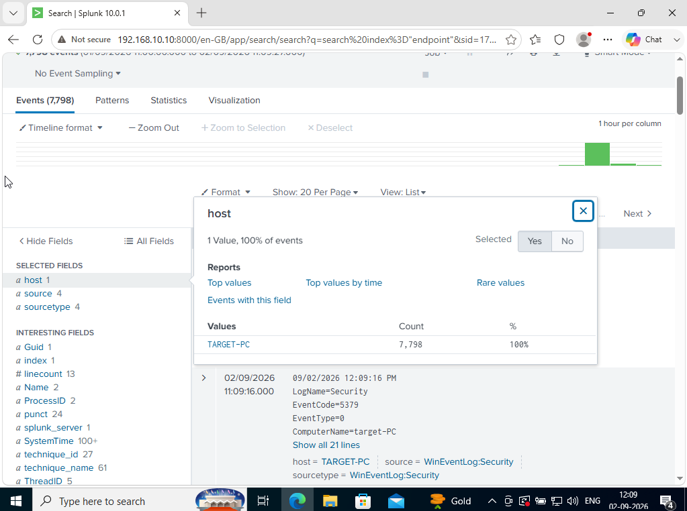

# Phase 2 — Splunk & Sysmon (Log Collection)

**Goal:** install and configure Sysmon and the Splunk Universal Forwarder on the
Windows target and server so they collect telemetry and ship it to the Splunk
server.

## Networking — put every VM on the same isolated network

1. In VirtualBox, create a **NAT Network** named `AD-Project` with an IPv4 prefix
   of `192.168.10.0/24` and apply it.
2. In each VM's **Settings → Network**, set *Attached to* → **NAT Network** and
   select `AD-Project`. Repeat for all four VMs.

## Configure a static IP on the Splunk server (Ubuntu)

1. Check the current IP — it starts out DHCP-assigned (`192.168.10.4`):
   ```bash
   ip a
   ```
   

2. Edit the netplan config to set a static address:
   ```bash
   sudo nano /etc/netplan/00-installer-config.yaml
   ```
   `dhcp4: no`, address `192.168.10.10/24`, nameserver `8.8.8.8`, default route
   via `192.168.10.1`.
   

3. Apply the configuration:
   ```bash
   sudo netplan apply
   ```
   

4. Verify the new static IP:
   ```bash
   ip a
   ```
   

## Install Splunk Enterprise (Ubuntu)

Download the Splunk Enterprise `.deb` package for Linux, then share it into the
VM using VirtualBox shared folders.

5. Install the guest additions ISO package:
   ```bash
   sudo apt-get install virtualbox-guest-additions-iso
   ```
   

6. In VirtualBox **Devices → Shared Folders → Add Share**, point at the folder
   containing the Splunk `.deb` (read-only, auto-mount, permanent):
   

7. Install guest utils:
   ```bash
   sudo apt-get install virtualbox-guest-utils
   ```
   
   Then reboot, add your user to the shared-folder group, and create a mount
   point:
   ```bash
   sudo adduser sujal vboxsf
   mkdir share
   ```

8. Mount the shared folder and confirm it's visible under your home directory:
   ```bash
   sudo mount -t vboxsf -o uid=1000,gid=1000 active_directory_project share/
   ls -la
   ```
   

9. `cd` into the mounted share and install the Splunk package:
   ```bash
   cd share
   sudo dpkg -i splunk-10.0.1-c486717c322b-linux-amd64.deb
   ```
   

10. Start Splunk as the `splunk` user:
    ```bash
    cd /opt/splunk
    sudo -u splunk bash
    cd bin
    ./splunk start
    ```
    

11. Enable Splunk to start automatically on every reboot:
    ```bash
    exit
    cd bin
    sudo ./splunk enable boot-start -user splunk
    ```
    

    > The `OPENSSL_3.4.0 not found` message here is a harmless warning from
    > the underlying systemd library check — it does not stop Splunk from
    > being configured to start on boot.

## Configure the Windows target machine

1. Rename the host to **target** and set a static IP via *Network & Internet
   settings → Change adapter options → IPv4 properties*:
   - IP: `192.168.10.100`
   - Subnet: `255.255.255.0`
   - Gateway: `192.168.10.1`
   - DNS: `8.8.8.8`

12. Confirm with `ipconfig`:
    

2. Confirm the Splunk web UI is reachable at `192.168.10.10:8000`.

### Install the Splunk Universal Forwarder (target)

- Download and install the Windows Universal Forwarder.
- Choose a Splunk Enterprise instance; set username `admin` and generate a
  random password.
- Set the receiving indexer to **`192.168.10.10:9997`**.

### Install Sysmon (target)

- Download Sysmon and the popular SwiftOnSecurity/Olaf `sysmonconfig.xml`
  (save the raw file).
- From an **admin PowerShell**, in the extracted Sysmon folder:
  ```powershell
  .\Sysmon64.exe -i ..\sysmonconfig.xml
  ```

### Configure `inputs.conf` (most important step)

Tell the forwarder what to send. Under
`C:\Program Files\SplunkUniversalForwarder\etc\system\`, create a `local`
folder and add an `inputs.conf` (see [`/configs/inputs.conf`](../configs/inputs.conf))
that forwards Application, Security, System, and Sysmon events to the
**`endpoint`** index.

> The index name matters: if the Splunk server has no index called
> `endpoint`, none of these events will be received.

Restart the **SplunkForwarder** service after any change to `inputs.conf`.

## Finalize the Splunk server

- Create the index: **Settings → Indexes → New Index → `endpoint`**.
- Enable receiving: **Settings → Forwarding and receiving → Configure
  receiving → New receiving port → `9997`**.

13. Confirm data is arriving from the target host:
    ```spl
    index="endpoint"
    ```
    7,798 events landed, all with `host = TARGET-PC` and
    `sourcetype = WinEventLog:Security`:
    

## Repeat for the Windows Server (ADDC01)

Same process, with two differences:
- Host name → **ADDC01**
- IP → **192.168.10.7**
- Do **not** create the `endpoint` index again — it already exists.

---
➡️ Continue to [Phase 3 — Active Directory](phase3-active-directory.md)
